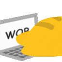
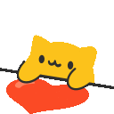
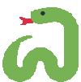
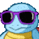
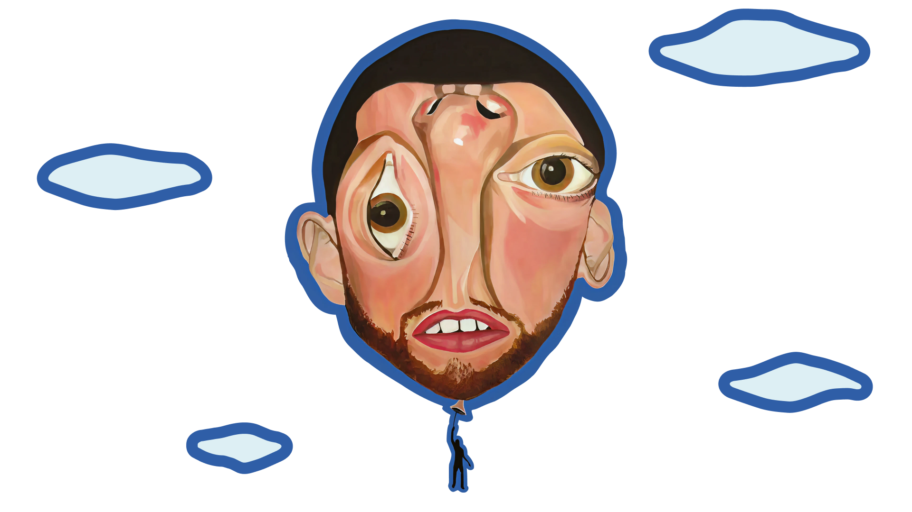

<!--Like what you see? Feel free to fork this profile — no need to ask, just do it. Have a great day! ❤️-->

<div align="center">

# `< 𝙷𝚎𝚢 𝚝𝚑𝚎𝚛𝚎! 𝙸'𝚖 𝙱𝚛𝚊𝚗𝚍𝚘𝚗 />` &nbsp; 

[+works+%F0%9F%94%A5;Making+bugs+features+since+day+1+%F0%9F%90%9B;Coffee+%E2%98%95+%2B+Code+%3D+Magic+%E2%9C%A8;Always+learning%2C+never+stopping+%F0%9F%9A%80)](https://git.io/typing-svg)

<p>
  
  &nbsp;
  
  &nbsp;
</p>

[](https://github.com/ItsDevMacB)
&nbsp;
[](https://github.com/ItsDevMacB)

</div>

---

## 👾 𝙰𝚋𝚘𝚞𝚝 𝙼𝚎 &nbsp; 

```jsx
// src/components/AboutMe.jsx

export default function AboutMe() {
  return (
    <Developer
      alias="Mac B"
      status="Designing my Portfolio 🖌️"
      location="Puebla, México 🇲🇽"
      birthday={new Date("2004-07-04")}
      role={["Front-end Developer", "UX/UI Designer Jr."]}
      languages={[
        { lang: "Spanish", level: "Native" },
        { lang: "English",  level: "Intermediate" },
      ]}
      passions={["sushi 🍣", "ramen 🍜", "coffee ☕", "clean UIs & good stuff"]}
      teamwork="I collaborate in teams with clear communication, constant feedback and desire to learn"
      currentlyLearning={["DevOps basics", "GSAP", "Three.js 🌐"]}
      motto="pixel-perfect or nothing 🎨"
    />
  );
}
```

---

## 🛠️ 𝚃𝚎𝚌𝚑 𝚂𝚝𝚊𝚌𝚔 &nbsp; 

<div align="center">

**𝙳𝚎𝚜𝚒𝚐𝚗**

[](https://skillicons.dev)

**𝙻𝚊𝚗𝚐𝚞𝚊𝚐𝚎𝚜**

[](https://skillicons.dev)

**𝙵𝚛𝚊𝚖𝚎𝚠𝚘𝚛𝚔𝚜 & 𝙻𝚒𝚋𝚛𝚊𝚛𝚒𝚎𝚜**

[](https://skillicons.dev)

**𝚃𝚘𝚘𝚕𝚜 & 𝙿𝚕𝚊𝚝𝚏𝚘𝚛𝚖𝚜**

[](https://skillicons.dev)

**𝙳𝚊𝚝𝚊𝚋𝚊𝚜𝚎𝚜**

[](https://skillicons.dev)

</div>

---

## 🌐 𝙲𝚘𝚗𝚗𝚎𝚌𝚝 𝚠𝚒𝚝𝚑 𝙼𝚎 &nbsp; 

<div align="center">

[](https://www.linkedin.com/in/devbrandon-martinez/)
&nbsp;
[](https://www.instagram.com/itsmac_b/)
&nbsp;
[](mailto:bmartinezcallejo.contacto@gmail.com)

</div>

---

## 📊 𝙶𝚒𝚝𝙷𝚞𝚋 𝚂𝚝𝚊𝚝𝚜 &nbsp; 

<div align="center">

[](https://git.io/streak-stats)

<br/>


&nbsp;


</div>

---

## 🐍 𝙼𝚢 𝙲𝚘𝚗𝚝𝚛𝚒𝚋𝚞𝚝𝚒𝚘𝚗 𝚂𝚗𝚊𝚔𝚎 &nbsp; 

<div align="center">

<picture>
  <source media="(prefers-color-scheme: dark)" srcset="https://raw.githubusercontent.com/ItsDevMacB/ItsDevMacB/output/AshSunset.svg">
  <!--I'm just made a Light Mode Snake Animation... For no reason, why LIGHT MODE???, C'mon... show your eyes some love! 🙏-->
  <source media="(prefers-color-scheme: light)" srcset="https://raw.githubusercontent.com/ItsDevMacB/ItsDevMacB/output/EmberDusk.svg">
  
</picture>

</div>

---

## 👥 𝙰𝚕𝚜𝚘 𝚌𝚑𝚎𝚌𝚔 𝚖𝚢 𝚐𝚞𝚢𝚜! &nbsp; 

<table align="center" class="friends-table">
  <tr>
    <th>&nbsp;</th>
    <th>GitHub</th>
    <th>Role</th>
  </tr>
  <tr>
    <td></td>
    <td><a href="https://github.com/OmarAnzures803"></a></td>
    <td><small>Full-Stack Developer</small></td>
  </tr>
  <tr>
    <td></td>
    <td><a href="https://github.com/devcarlosGM"></a></td>
    <td><small>Full-Stack Developer</small></td>
  </tr>
  <tr>
    <td></td>
    <td><a href="https://github.com/CrafterJe"></a></td>
    <td><small>Back-end Developer</small></td>
  </tr>
  <tr>
    <td></td>
    <td><a href="https://github.com/Cacaguadios"></a></td>
    <td><small>Back-end Developer</small></td>
  </tr>
  <tr>
    <td></td>
    <td><a href="https://github.com/DiegoLopSed"></a></td>
    <td><small>Back-end Developer</small></td>
  </tr>
</table>

<br/>

---

<div align="center">



<h3>✦ &nbsp; <strong><em>𝑻𝒉𝒆 𝒃𝒆𝒔𝒕 𝒊𝒔 𝒚𝒆𝒕 𝒕𝒐 𝒄𝒐𝒎𝒆.</em></strong> &nbsp; ✦</h3>
<p>𝓜𝓪𝓬 𝓜𝓲𝓵𝓵𝓮𝓻 🎵</p>

---

<br>


</div>
